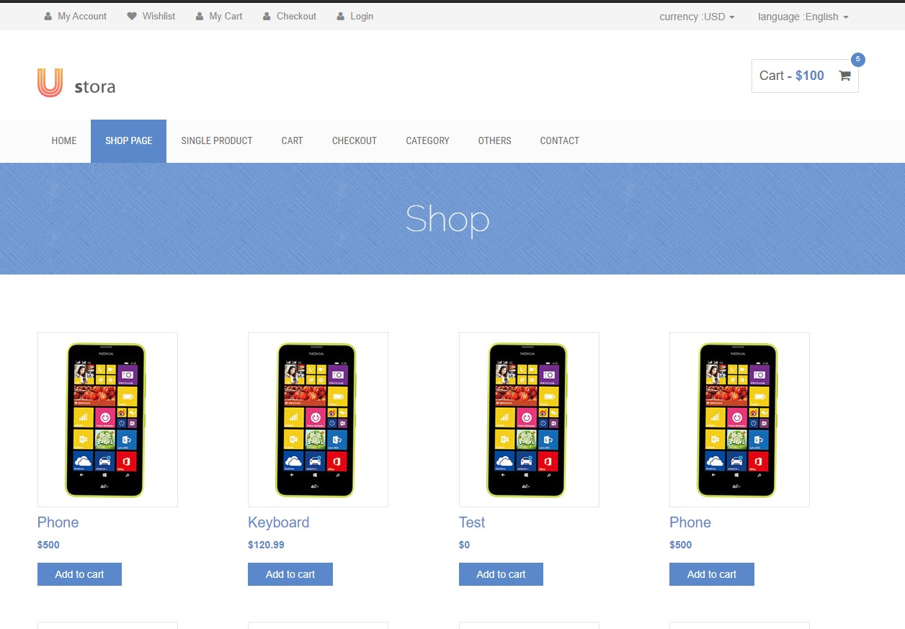
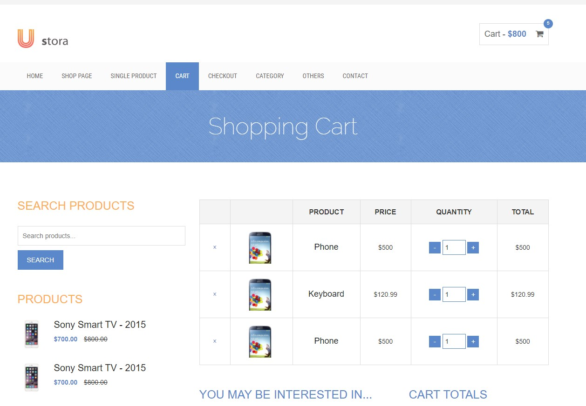

# Online Shop - Web App
A simple electronics online shop.

# Inspiration
This is the front end application for the Online Shop app, developed during the Java Bootcamp. 
The back end was developed separately (https://github.com/dieterhalosta/online-shop) using Java, Spring Boot and MySQL.
For the front end side I used a Bootstrap template and jQuery to connect with the back end.

# Development stack
+ [JavaScript]
+ [Bootstrap] for the features and easy to use templates.
+ [Ustora UI] as a templates.
+ I used [jQuery] to connect with the back end.
+ I used git for version control, and stored progress on GitHub.
+ Currently only tested on an Windows enviorment.

# Current progress
- [x] App skeleton
- [x] Basic layer prototype
- [x] Created the main index page as a catalog of products
- [x] Created the Shop page
- [x] Created the Product page
- [x] Created the Cart Page
- [x] Connect with the back end with jQuery
- [ ] Remove extra code from the template
- [ ] Connect with a payment service such as Stripe payments
- [ ] Make page more responsive and mobile friendly

# Running

## Clone

+ Clone this repo `git@github.com:dieterhalosta/online-shop-web-app.git`

## License

Released under the [MIT License](http://opensource.org/licenses/MIT).

# Feedback

Feedback is always welcome. Feel free to contact me, I would love to know if you notice something that can be done better.
